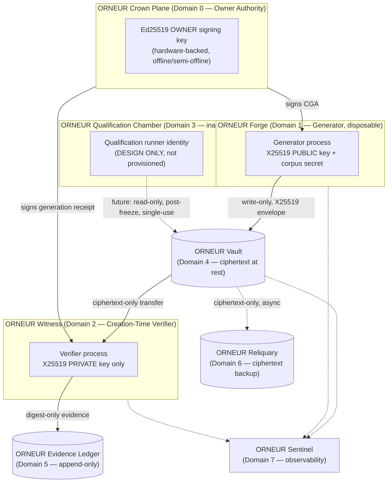

# GENESIS V2 — ORNEUR Sovereign Infrastructure Architecture

Status: **DESIGN ONLY — NOT PROVISIONED**. No resource described here has been created. `private_storage_genuinely_configured` remains `false`. `CORPUS_GENERATION_AUTHORIZATION.status` remains `NOT_AUTHORIZED`.

This document is the entry point for the ORNEUR Genesis V2 infrastructure package. It assumes the reader has reviewed `GENESIS_V2_TRUST_DOMAIN_MODEL.md` for the detailed per-domain contract and `GENESIS_V2_THREAT_AND_COMPROMISE_MATRIX.md` for the adversarial analysis that shaped these decisions.

## 0. Doctrine

> Intelligence may propose. Runtime policy may evaluate. Authority must be independently enforced. Consequential execution must never depend on trust in the proposing component.
> No component should possess more authority, plaintext, credentials, or evidence than its role strictly requires.
> MODEL GENERATES INTELLIGENCE. ORNEUR OWNS THE CONTRACT.

Every decision below is justified by asking: *if this component is fully compromised, what does ORNEUR still protect?* The answer is tabulated in `GENESIS_V2_THREAT_AND_COMPROMISE_MATRIX.md`.

## 1. Why this is not a generic "deploy the app" problem

ORNEUR's public-facing serving infrastructure (Fly.io `orca-demo`, the `k8s/` manifests, the Phase 14B Northflank/Supabase/Cloudflare staging stack) already exists and already works for what it is: a single-replica web API with a shared Postgres backend, reachable from the internet, operated by one admin identity. That architecture is **correct for a product API** and **wrong for Genesis V2** for one structural reason: Genesis V2's entire value is that a short list of named, independently-verified facts (who generated this corpus, under what authorization, from what code, at what commit, signed by whom, received intact by whom) remain true even if any *one* of generator, verifier, CI, or a cloud account is compromised. A single shared-trust web stack cannot provide that; its job is availability and developer velocity, not compartmentalized authority.

Genesis V2 therefore gets its **own, deliberately smaller and more restrictive infrastructure**, independent of the product stack, sized to the actual number of real identities the code already defines: **OWNER**, **GENERATOR**, **CREATION-TIME VERIFIER**, and (inactive) **QUALIFICATION RUNNER**.

## 2. The ORNEUR Sovereign Runtime Plane

Seven named trust domains, detailed individually in `GENESIS_V2_TRUST_DOMAIN_MODEL.md`:

| # | Domain | Role | Holds | Never holds |
|---|---|---|---|---|
| 0 | **ORNEUR Crown Plane** | Owner authority: signs CGAs, receipts, manifests; emergency revocation | Ed25519 signing key (hardware-backed, Tier ≥1) | vault private key, generator code execution, any network listener |
| 1 | **ORNEUR Forge** | Real corpus generation | generator identity, X25519 **public** key, corpus secret, signed CGA | X25519 private key, owner key, any unrelated credential |
| 2 | **ORNEUR Witness** | Creation-time ciphertext verification | X25519 **private** key, restricted verifier identity, ledger access | generator write capability, owner key, training/model credentials |
| 3 | **ORNEUR Qualification Chamber** | Post-freeze holdout qualification (**inactive**) | distinct qualification-runner identity (design only) | nothing provisioned yet |
| 4 | **ORNEUR Vault** | Encrypted corpus-at-rest | ciphertext objects only | plaintext, any private key |
| 5 | **ORNEUR Evidence Ledger** | Append-only provenance record | digests, signatures, hashes, ledger records | plaintext, secrets |
| 6 | **ORNEUR Reliquary** | Ciphertext-only backup / DR | encrypted backup copies | private keys, plaintext |
| 7 | **ORNEUR Sentinel** | Observability without content leakage | metrics, alerts, access logs | plaintext, secret values |

## 3. What already exists vs. what Genesis V2 needs

See `GENESIS_V2_PROVIDER_DECISION_MATRIX.md` for the full classification. Summary: **nothing currently deployed is suitable for hosting the Genesis V2 vault or key material**, confirming the conclusion already reached in `GENESIS_V2_INFRASTRUCTURE_DISCOVERY.md`. Fly.io/k8s are public-facing single-replica serving layers. Northflank/Supabase/Cloudflare (Phase 14B) is a live, internet-reachable staging environment scoped to a *different* security boundary (Godmode/authority distribution) — reusing it for Genesis V2 would merge two blast radii that the code has gone to considerable lengths to keep separate. GitHub Actions is suitable for **CI verification and evidence-snapshot checks** (it already is the exact-SHA CI substrate) but not for holding long-lived private key material: shared/ephemeral runners, a public repository, and no secret-manager broker today.

## 4. Recommended path (see §E of the final report for full reasoning)

**Strategy C — Hybrid Sovereign**, staged:

- **Tier 0 (now, $0 incremental)**: owner signing key in macOS Keychain or a cheap hardware security key (YubiKey, ~$25–55, one-time); Generator and Verifier as two separate local processes/users on owner-controlled machine(s), never both holding both key halves; vault = hardened local encrypted directory; backup = an external encrypted drive, ciphertext only; evidence = the existing SQLite-backed `AccessLedger` plus the existing read-only evidence-snapshot tooling, periodically git-committed as append-only JSON.
- **Tier 1 (production-hardened)**: Generator and Verifier become genuinely separate machines (or separate cloud VMs in **separate cloud accounts**, not just separate processes); vault moves to immutable/WORM-capable object storage (e.g. S3 Object Lock or equivalent) in a dedicated cloud account used for nothing else; owner key moves to a hardware token used through a documented signing ceremony; backup becomes a second, geographically/provider-distinct ciphertext copy.
- **Tier 2 (enterprise)**: HSM/KMS-backed owner key, multi-provider resilience for vault + backup, dedicated SIEM-grade observability, formal IaC with policy-as-code review gates.

Full cost breakdown: `GENESIS_V2_COST_MODEL.md`. Full IAM matrix: `GENESIS_V2_IAM_MATRIX.md`. Full network policy: `GENESIS_V2_NETWORK_POLICY.md`. Full secret custody plan: `GENESIS_V2_SECRET_CUSTODY_PLAN.md`. Full vault storage design: `GENESIS_V2_VAULT_STORAGE_DESIGN.md`. Full backup/DR plan: `GENESIS_V2_BACKUP_AND_DR_PLAN.md`. Full owner signing ceremony: `GENESIS_V2_OWNER_SIGNING_CEREMONY.md`. Full deployment acceptance criteria: `GENESIS_V2_REAL_DEPLOYMENT_ACCEPTANCE.md`. Full incident/revocation runbook: `GENESIS_V2_INCIDENT_AND_REVOCATION_RUNBOOK.md`.

## 5. What this phase delivers vs. what it explicitly does not

Delivers: architecture, trust-domain contracts, provider analysis, IAM/network/secret design, vault/backup design, owner ceremony design, deployment-acceptance criteria (with a synthetic/code-level validation suite), incident runbook, cost model, threat matrix, and an IaC skeleton that provisions nothing.

Does not: create any cloud account, purchase any hardware, generate any real key, touch `CORPUS_GENERATION_AUTHORIZATION.json`, activate the vault, register a real generator, or change `private_storage_genuinely_configured`. Every "OWNER DECISION REQUIRED" card in this package is a gate, not a default.
